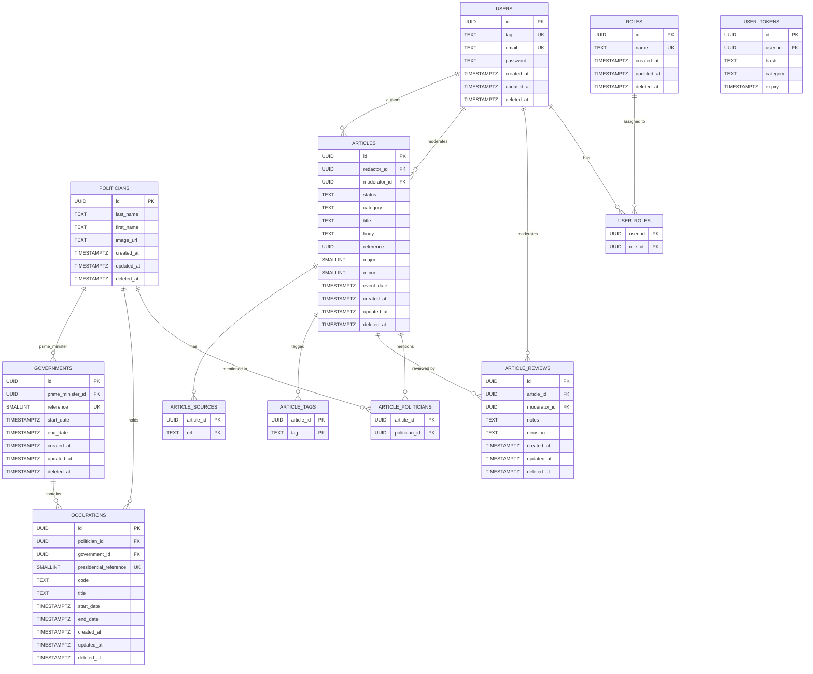

# Database Schema

Certaines colonnes sont susceptibles d'être supprimées, notamment 
**governments.reference** et **occupations.presidential_reference** qui proviennent
des fichiers csv du module data_import, ainsi que les colonnes 
**created_at**, **updated_at**, et **deleted_at** qui ne sont peut-être pas nécessaires
sur toutes les tables.

Pour le détail des clefs primaires/secondaires, les index, et les différentes contraintes,
voir le fichier [schema.sql](schema.sql).

## Diagramme ER à visualiser sur GitHub pour le rendu mermaid

