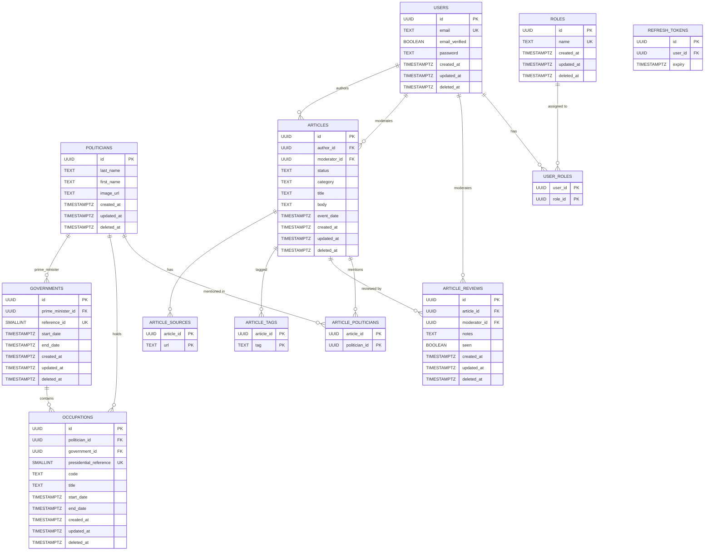

# Database Schema (MPD)

The following Mermaid ER diagram is generated from `db/schema.sql` and is compatible with GitHub rendering.

Notes:
- Check constraints (like status/category enums and exclusivity on OCCUPATIONS) are documented in SQL but not visualized in Mermaid.
- Nullable foreign keys (e.g., moderator_id, government_id) are shown as FK attributes without cardinality change; semantics are documented in SQL.
